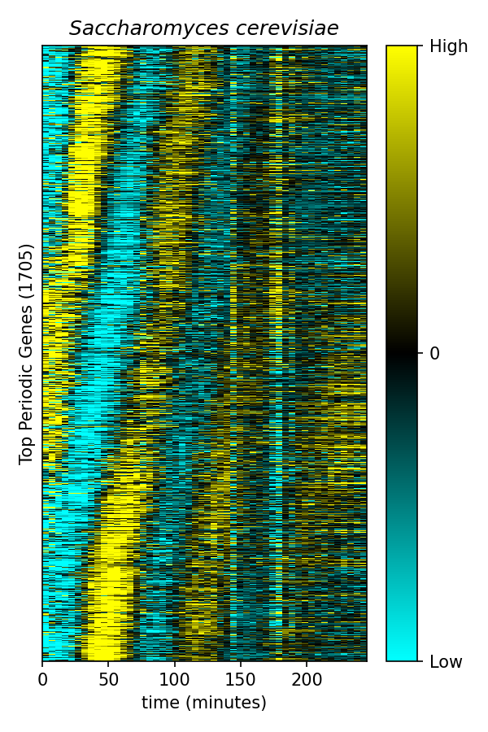

# Figure 2A — Cell-Cycle-Regulated Transcription

Reproduction de la **Figure 2A** de Kelliher et al. 2016 (*PLOS Genetics*) : une
heatmap des gènes périodiques de *Saccharomyces cerevisiae* au cours du cycle
cellulaire. Chaque ligne est un gène, chaque colonne un point temporel ;
l'expression est normalisée en z-score et les gènes sont ordonnés par phase du
pic d'expression, faisant apparaître les vagues diagonales de transcription.



## Prérequis

- [Pixi](https://pixi.sh) installé
- Python 3.10+

## Installation

```bash
git clone https://github.com/votre-compte/IA-BioSoftware-Workshop.git
cd IA-BioSoftware-Workshop/tp_python
pixi install
```

## Utilisation

```bash
# Avec les chemins par défaut (données dans ../data/)
pixi run python figure_2a.py

# En précisant les fichiers d'entrée / sortie
pixi run python figure_2a.py \
  --input ../data/oscillating-genes_1705_normalized-profiles.tsv \
  --output figure_2a.png
```

Le script lit la matrice de profils normalisés, calcule le z-score par gène,
ordonne les gènes par phase, puis sauvegarde la heatmap en PNG.

## Commandes disponibles

| Commande                  | Description                        |
|---------------------------|------------------------------------|
| `pixi run figure`         | Génère la Figure 2A                |
| `pixi run lint`           | Vérification de la qualité du code |
| `pixi run format`         | Formatage automatique              |
| `pixi run typecheck`      | Vérification du typage             |
| `pixi run test`           | Lancement des tests unitaires      |
| `pixi run coverage`       | Rapport de couverture de tests     |
| `pixi run safety-check`   | Scan de vulnérabilités             |
| `pixi run all-checks`     | Lint + typecheck + tests           |

## Structure du projet

```bash
tp_python/
├── figure_2a.py        # Script principal (pipeline de reproduction)
├── tests/              # Tests unitaires (pytest)
│   ├── __init__.py
│   └── test_figure_2a.py
├── pyproject.toml      # Configuration ruff / pyright / pytest
├── pixi.toml           # Environnement et dépendances
├── figure_2a.png       # Figure générée
└── README.md           # Ce fichier
```

## Méthode

1. **Chargement** du TSV (1705 gènes × 50 points temporels, 1 prélèvement / 5 min).
2. **Normalisation z-score** par gène : `(x − moyenne) / écart-type`.
3. **Tri par phase** : extraction de la phase de la composante de Fourier à la
   période du cycle cellulaire (~75 min) → temps du pic d'expression.
4. **Heatmap** : colormap cyan → noir → jaune, bornée à [−1.5, +1.5].

## Données

Fichier `../data/oscillating-genes_1705_normalized-profiles.tsv` (profils
d'expression RNA-seq, accession GEO **GSE80474**).

## Outil IA utilisé

- **Groupe** : 01 — reverse engineering
- **Outil** : Claude Code
- **Modèle** : Claude Fable 5 (`claude-fable-5`)
- **Nombre de requêtes** : ~13 (prompts utilisateur de la session)
- **Nombre de tokens utilisés** : _à compléter avec la sortie de `/cost`_ (la
  commande `/cost` de Claude Code affiche le total de tokens et le coût de la
  session)

## Licence

MIT — voir l'en-tête du projet.

## Référence

Kelliher CM, Leman AR, Sierra CS, Haase SB (2016) Investigating Conservation of
the Cell-Cycle-Regulated Transcriptional Program in the Fungal Pathogen,
*Cryptococcus neoformans*. PLOS Genetics 12(12): e1006453.
<https://doi.org/10.1371/journal.pgen.1006453>
