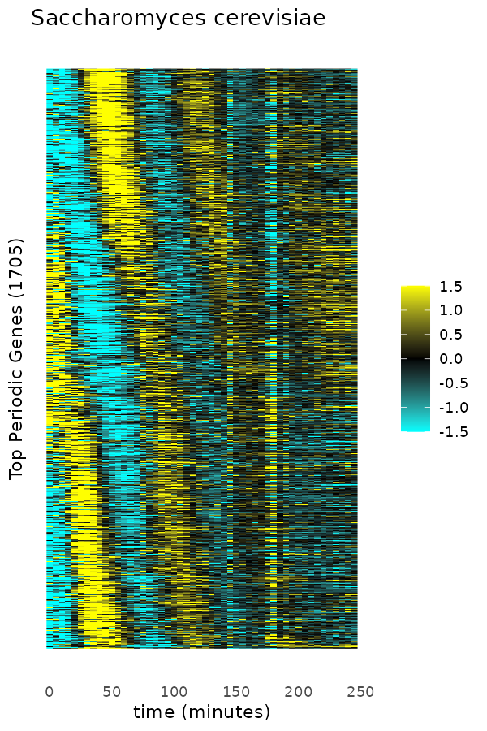

<!-- README.md est genere a partir de README.Rmd. Editez le .Rmd puis lancez `devtools::build_readme()`. -->

# cellcyclefig2a

Reproduction de la **Figure 2A** de Kelliher et al. 2016 (*PLOS
Genetics*) : une heatmap des genes periodiques du cycle cellulaire de
*Saccharomyces cerevisiae*. Les profils d’expression sont normalises en
z-score par gene, puis les genes sont ordonnes par phase du pic
d’expression.

<figure>

<figcaption aria-hidden="true">Figure 2A reproduite</figcaption>
</figure>

## Installation

``` r
# Installer depuis GitHub
devtools::install_github("ggautreau/IA-BioSoftware-Workshop", subdir = "tp_r/cellcyclefig2a")
```

## Utilisation

``` r
library(cellcyclefig2a)

# Pipeline complet : charge, normalise, ordonne et sauvegarde la figure
build_figure(
  "../../data/oscillating-genes_1705_normalized-profiles.tsv",
  "figure_2a.png"
)
```

Ou etape par etape :

``` r
profiles <- load_profiles("../../data/oscillating-genes_1705_normalized-profiles.tsv")
zscores <- zscore_per_gene(profiles)
ordered <- order_by_peak_phase(zscores)
plot_heatmap(ordered)
```

En ligne de commande :

``` sh
Rscript run.R [chemin_donnees] [chemin_sortie]
```

## Developpement

Restaurer l’environnement reproductible (renv) :

``` r
renv::restore()
```

Lancer les verifications :

``` r
styler::style_pkg()        # Formatage
lintr::lint_package()      # Qualite du code (0 warning)
devtools::test()           # Tests unitaires
covr::package_coverage()   # Couverture (100 %)
devtools::check()          # Verification complete (0 error / 0 warning / 0 note)
```

### Audit des dependances (oysteR)

`oysteR` interroge l’API Sonatype OSS Index, qui requiert depuis peu une
authentification (un compte gratuit suffit :
<https://ossindex.sonatype.org>). Sans identifiants, l’API renvoie une
erreur HTTP 401. Une fois le jeton obtenu :

``` r
Sys.setenv(OSSINDEX_USER = "votre-email", OSSINDEX_TOKEN = "votre-token")
library(oysteR)
audit <- audit_description(".")
get_vulnerabilities(audit)   # data.frame vide attendu = aucune vulnerabilite
```

Les dependances runtime (`ggplot2`, `scales`, `rlang`) sont des paquets
CRAN courants et a jour, sans avis de securite connu.

## Reference

Kelliher CM, Leman AR, Sierra CS, Haase SB (2016) Investigating
Conservation of the Cell-Cycle-Regulated Transcriptional Program in the
Fungal Pathogen, *Cryptococcus neoformans*. PLOS Genetics 12(12):
e1006453. <https://doi.org/10.1371/journal.pgen.1006453>
